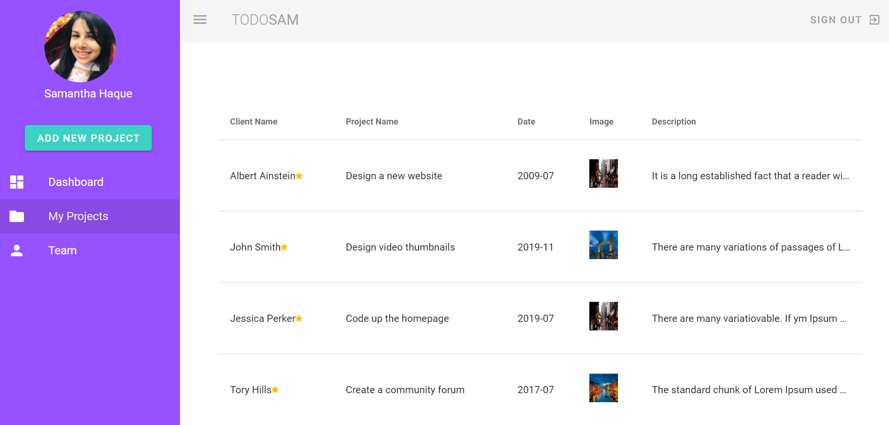
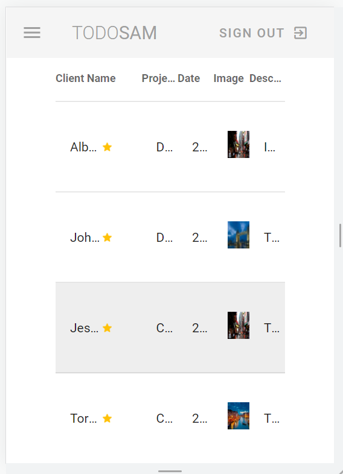
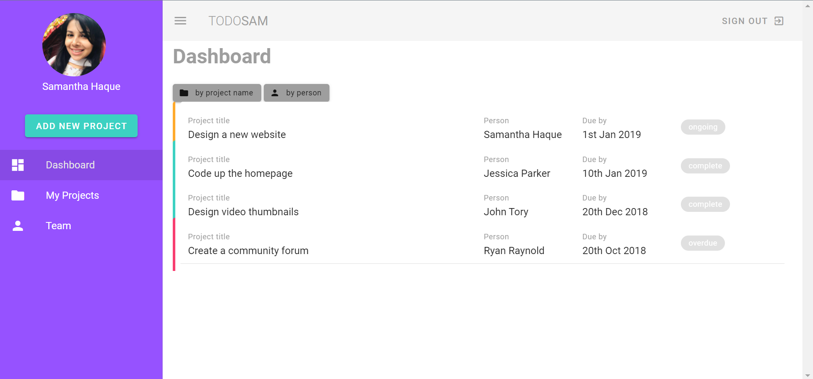
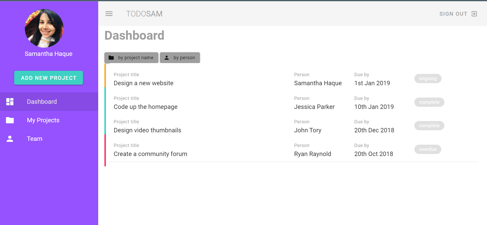
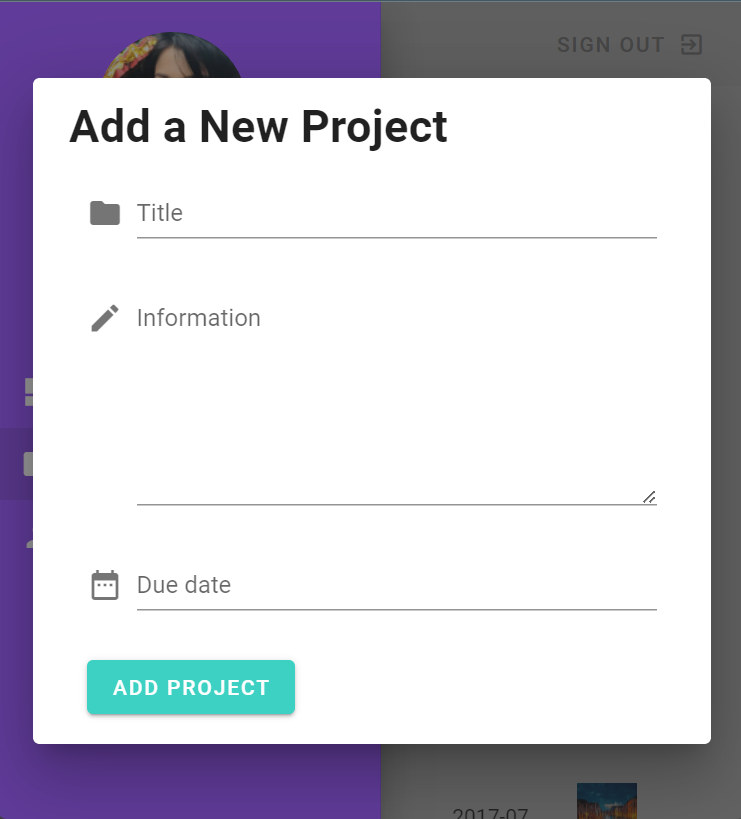
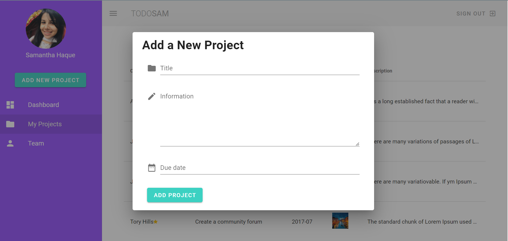
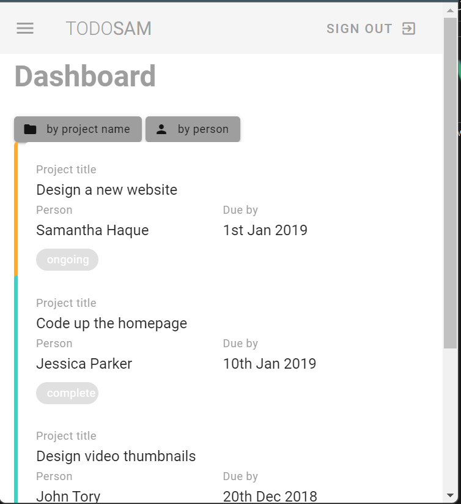
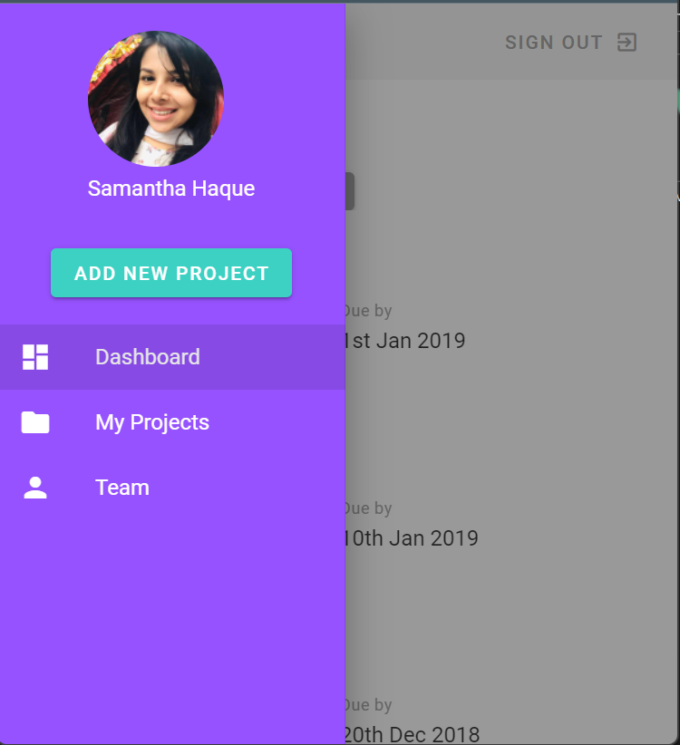

# samTodo(Vuetify)

## Project setup
```
npm install
```

### Compiles and hot-reloads for development
```
npm run serve
```

### Compiles and minifies for production
```
npm run build
```

## Technologies
<hr>
<ul>
<li>Vue Js</li>
<li>Vuetify </li>
</ul>

## Tests

### Description
A project maangement system design with easy to understand user interface where vuetify has been used to design every section.User can add projects and see project,client details,assigned date and to who it has been assigned to. In further implementation the functionalities and other feature will be added and improved.

### Goal of the Project
<ul> 
  <li>To have a data table that will not break in any screen sizes and the star beside the name will always remain inline whereas the letters of the name will be     reduced by dots </li>
  <li> Designing Structure using only Vuetify and completely responsive </li>
</ul>


### Screenshots
<u>Data Table</u><br><br>

<br><br>
<u>Dashboard</u> <br><br>

<br><br>
<u>Pop Up</u><br><br>

<br><br>
<u>Dashboard Mobile </u><br><br>




### Customize configuration
See [Configuration Reference](https://cli.vuejs.org/config/).
